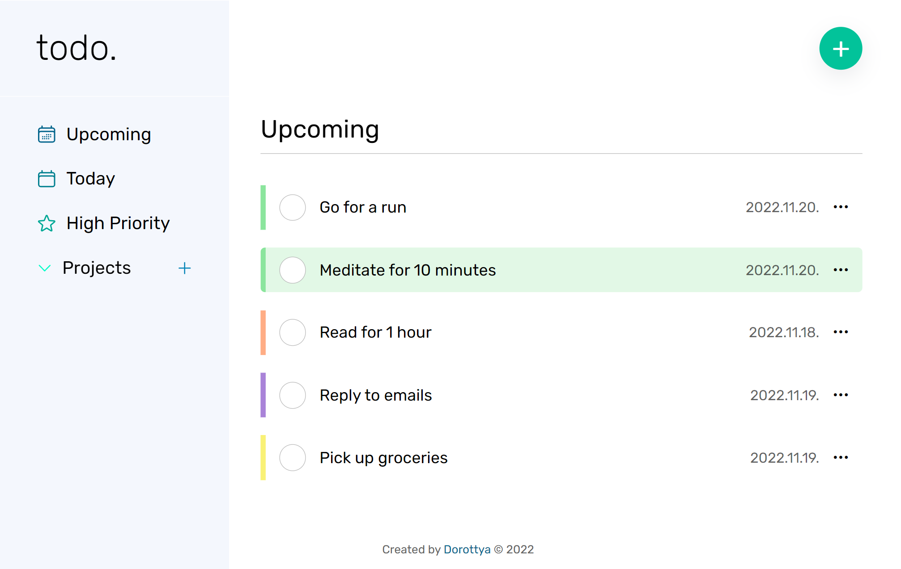

# The Odin Project - Todo List

### Assignment

The user shoud be able to

1. view all projects
2. view all todos in each project
3. expand a single todo to see/edit its details
4. delete a todo

### Built with

- Semantic HTML5 markup
- CSS custom properties
- Flexbox
- CSS Grid
- Mobile-first workflow
- JavaScript
- Webpack
- localStorage

### Screenshot

## Author

- Website - [Dorottya](https://github.com/DorottyaB)
