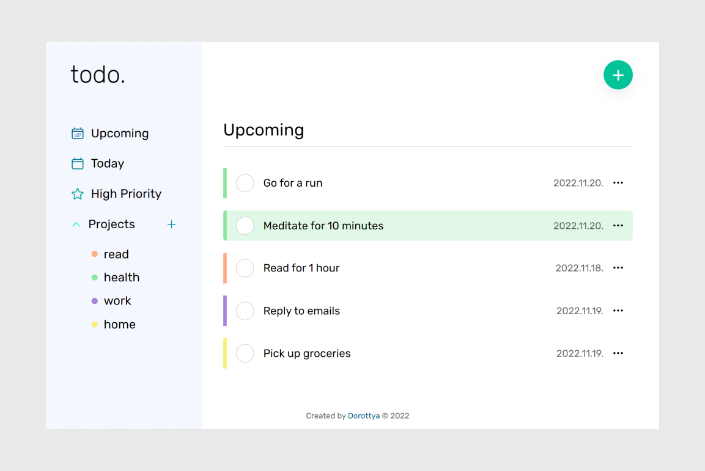

# The Odin Project - Todo List

### Assignment

The user shoud be able to

1. add todos
2. view all todos in each category
3. view all projects
4. view all todos in each project
5. expand a single todo to see/edit its details
6. delete a todo

### Built with

- Semantic HTML5 markup
- CSS custom properties
- Flexbox
- CSS Grid
- Mobile-first workflow
- JavaScript
- Webpack
- localStorage

### Link

[https://todo-app-js-pi.vercel.app](https://todo-app-js-pi.vercel.app)

### Screenshot

## Author

- Website - [Dorottya](https://github.com/DorottyaB)
